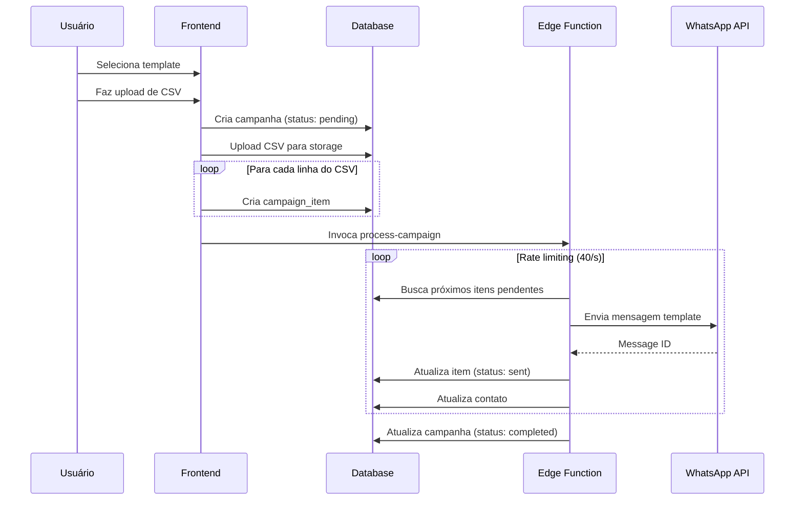
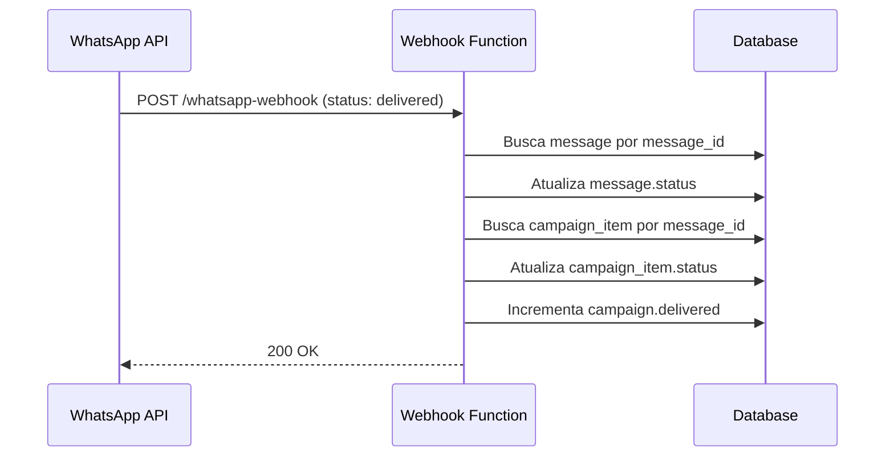
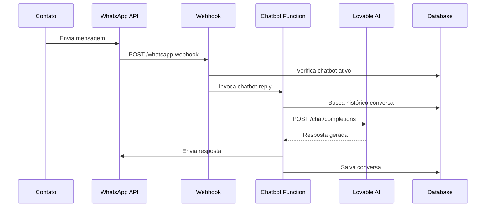
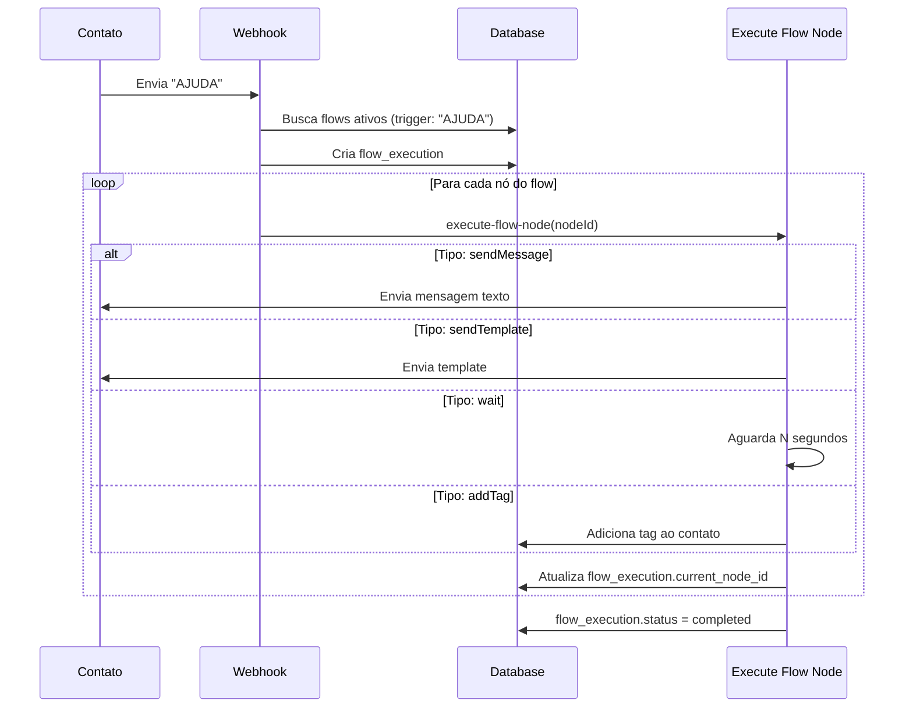

# DisparoX - Especificação Técnica Completa

## 1. VISÃO GERAL

DisparoX é uma plataforma de gerenciamento e automação de mensagens WhatsApp Business via WhatsApp Business API (Meta). Permite:
- Gerenciar múltiplos números WhatsApp Business
- Criar e sincronizar templates de mensagem
- Executar campanhas em massa com controle de taxa (rate limiting)
- Automação via flows visuais
- Chatbot IA com OpenAI/Gemini
- Gestão de contatos com tags e opt-out
- Analytics e relatórios detalhados

---

## 2. ARQUITETURA

### 2.1 Stack Tecnológico Atual
- **Frontend**: React 18 + TypeScript + Vite
- **UI**: Tailwind CSS + shadcn/ui components
- **Backend**: Supabase (PostgreSQL + Edge Functions Deno)
- **Autenticação**: Supabase Auth (email/password)
- **Storage**: Supabase Storage (CSVs de campanha)
- **API Externa**: WhatsApp Business API (Graph API v21.0)

### 2.2 Estrutura de Camadas
```
┌─────────────────────────────────────┐
│   Frontend (React SPA)              │
│   - Páginas/Rotas                   │
│   - Componentes UI                  │
│   - Queries (React Query)           │
└────────────┬────────────────────────┘
             │
             ▼
┌─────────────────────────────────────┐
│   Supabase Client (RLS)             │
│   - Auth                            │
│   - Database (Postgrest)            │
│   - Storage                         │
│   - Edge Functions                  │
└────────────┬────────────────────────┘
             │
             ▼
┌─────────────────────────────────────┐
│   PostgreSQL Database               │
│   - Tables + RLS Policies           │
│   - Functions + Triggers            │
└─────────────────────────────────────┘
             │
             ▼
┌─────────────────────────────────────┐
│   WhatsApp Business API             │
│   - Templates                       │
│   - Messages                        │
│   - Webhooks                        │
└─────────────────────────────────────┘
```

---

## 3. MODELO DE DADOS (Database Schema)

### 3.1 whatsapp_numbers
Armazena configurações de contas WhatsApp Business.

```sql
CREATE TABLE whatsapp_numbers (
  id UUID PRIMARY KEY DEFAULT gen_random_uuid(),
  user_id UUID REFERENCES auth.users,
  name TEXT NOT NULL,
  phone_number_id TEXT NOT NULL,
  phone_number TEXT,
  waba_id TEXT NOT NULL,
  business_account_id TEXT,
  access_token TEXT NOT NULL, -- Token de acesso da Meta
  display_name TEXT,
  quality_rating TEXT DEFAULT 'GREEN', -- GREEN, YELLOW, RED
  is_active BOOLEAN DEFAULT true,
  created_at TIMESTAMPTZ DEFAULT now(),
  updated_at TIMESTAMPTZ DEFAULT now()
);
```

**RLS**: Autenticados podem ver e gerenciar seus números.

### 3.2 templates
Templates de mensagem aprovados no WhatsApp Business Manager.

```sql
CREATE TABLE templates (
  id UUID PRIMARY KEY DEFAULT gen_random_uuid(),
  user_id UUID,
  whatsapp_number_id UUID REFERENCES whatsapp_numbers(id),
  name TEXT NOT NULL,
  language TEXT NOT NULL DEFAULT 'pt_BR',
  status TEXT NOT NULL DEFAULT 'APPROVED', -- APPROVED, PENDING, REJECTED
  structure JSONB NOT NULL DEFAULT '{}', -- Estrutura do template (body, header, buttons)
  mappings JSONB NOT NULL DEFAULT '{}', -- Mapeamento de variáveis para CSV
  is_active BOOLEAN DEFAULT true,
  created_at TIMESTAMPTZ DEFAULT now(),
  updated_at TIMESTAMPTZ DEFAULT now()
);
```

**structure JSONB**:
```json
{
  "body": {
    "text": "Olá {{1}}, seu CPF {{2}} está pendente.",
    "vars": [1, 2]
  },
  "header": {
    "format": "TEXT", // TEXT, IMAGE, VIDEO, DOCUMENT
    "text": "Atenção {{1}}",
    "vars": [1]
  },
  "buttons": [
    {
      "index": 0,
      "type": "URL",
      "text": "Ver detalhes",
      "url": "https://exemplo.com/{{1}}",
      "hasVars": true,
      "vars": [1]
    }
  ]
}
```

**mappings JSONB**:
```json
{
  "language": "pt_BR",
  "body": {
    "1": {"kind": "col", "name": "nome"},
    "2": {"kind": "col", "name": "cpf"}
  },
  "header": {
    "1": {"kind": "const", "value": "Cliente"}
  },
  "buttons": [
    {
      "index": 0,
      "type": "URL",
      "vars": {
        "1": {"kind": "col", "name": "id"}
      }
    }
  ]
}
```

### 3.3 campaigns
Campanhas de envio em massa.

```sql
CREATE TABLE campaigns (
  id UUID PRIMARY KEY DEFAULT gen_random_uuid(),
  user_id UUID,
  whatsapp_number_id UUID REFERENCES whatsapp_numbers(id),
  name TEXT NOT NULL,
  template_name TEXT,
  language TEXT DEFAULT 'pt_BR',
  csv_file_url TEXT, -- URL do CSV no storage
  status TEXT DEFAULT 'pending', -- pending, processing, completed, failed
  total_items INTEGER DEFAULT 0,
  sent INTEGER DEFAULT 0,
  delivered INTEGER DEFAULT 0,
  read INTEGER DEFAULT 0,
  failed INTEGER DEFAULT 0,
  processing_rate INTEGER DEFAULT 40, -- Mensagens por segundo
  error_summary JSONB DEFAULT '{}',
  created_at TIMESTAMPTZ DEFAULT now(),
  updated_at TIMESTAMPTZ DEFAULT now()
);
```

**error_summary JSONB**:
```json
{
  "132015": 5, // Código erro: quantidade
  "131047": 2
}
```

### 3.4 campaign_items
Itens individuais de cada campanha.

```sql
CREATE TABLE campaign_items (
  id UUID PRIMARY KEY DEFAULT gen_random_uuid(),
  campaign_id UUID REFERENCES campaigns(id) ON DELETE CASCADE,
  msisdn TEXT NOT NULL, -- Número destino (formato: 5511999999999)
  params JSONB, -- Parâmetros para substituir no template
  status TEXT DEFAULT 'pending', -- pending, sent, delivered, read, failed
  message_id TEXT, -- ID retornado pela API WhatsApp
  error_code TEXT,
  error_message TEXT,
  fbtrace_id TEXT,
  retry_count INTEGER DEFAULT 0,
  next_retry_at TIMESTAMPTZ,
  last_error_at TIMESTAMPTZ,
  created_at TIMESTAMPTZ DEFAULT now(),
  updated_at TIMESTAMPTZ DEFAULT now()
);
```

**params JSONB**:
```json
{
  "body_1": "João Silva",
  "body_2": "123.456.789-00",
  "header_1": "Cliente Premium",
  "button_0_1": "abc123"
}
```

### 3.5 contacts
Gestão de contatos.

```sql
CREATE TABLE contacts (
  id UUID PRIMARY KEY DEFAULT gen_random_uuid(),
  user_id UUID,
  msisdn TEXT NOT NULL, -- Número WhatsApp
  name TEXT,
  cpf TEXT,
  opt_out BOOLEAN DEFAULT false,
  opt_out_date TIMESTAMPTZ,
  opt_out_reason TEXT,
  last_message_sent_at TIMESTAMPTZ,
  created_at TIMESTAMPTZ DEFAULT now(),
  updated_at TIMESTAMPTZ DEFAULT now(),
  UNIQUE(user_id, msisdn)
);
```

### 3.6 tags
Tags para categorizar contatos.

```sql
CREATE TABLE tags (
  id UUID PRIMARY KEY DEFAULT gen_random_uuid(),
  user_id UUID,
  name TEXT NOT NULL,
  color TEXT NOT NULL DEFAULT '#3B82F6',
  created_at TIMESTAMPTZ DEFAULT now()
);
```

### 3.7 contact_tags
Relacionamento N:N entre contatos e tags.

```sql
CREATE TABLE contact_tags (
  id UUID PRIMARY KEY DEFAULT gen_random_uuid(),
  contact_id UUID REFERENCES contacts(id) ON DELETE CASCADE,
  tag_id UUID REFERENCES tags(id) ON DELETE CASCADE,
  created_at TIMESTAMPTZ DEFAULT now(),
  UNIQUE(contact_id, tag_id)
);
```

### 3.8 messages
Registro de todas mensagens enviadas/recebidas.

```sql
CREATE TABLE messages (
  id UUID PRIMARY KEY DEFAULT gen_random_uuid(),
  whatsapp_number_id UUID REFERENCES whatsapp_numbers(id),
  msisdn TEXT NOT NULL,
  direction TEXT NOT NULL, -- 'outbound', 'inbound'
  message_id TEXT, -- ID da API WhatsApp
  phone_id TEXT,
  template_name TEXT,
  content JSONB,
  status TEXT DEFAULT 'pending',
  error_code TEXT,
  error_message TEXT,
  fbtrace_id TEXT,
  created_at TIMESTAMPTZ DEFAULT now(),
  updated_at TIMESTAMPTZ DEFAULT now()
);
```

### 3.9 flows
Automações de fluxo (visual flow builder).

```sql
CREATE TABLE flows (
  id UUID PRIMARY KEY DEFAULT gen_random_uuid(),
  user_id UUID,
  whatsapp_number_id UUID REFERENCES whatsapp_numbers(id),
  name TEXT NOT NULL,
  description TEXT,
  trigger_type TEXT NOT NULL, -- 'keyword', 'any_message', 'button_click'
  trigger_keyword TEXT,
  is_active BOOLEAN DEFAULT true,
  nodes JSONB NOT NULL DEFAULT '[]',
  edges JSONB NOT NULL DEFAULT '[]',
  created_at TIMESTAMPTZ DEFAULT now(),
  updated_at TIMESTAMPTZ DEFAULT now()
);
```

**nodes JSONB** (React Flow format):
```json
[
  {
    "id": "1",
    "type": "trigger",
    "data": {"label": "Palavra-chave: AJUDA"},
    "position": {"x": 0, "y": 0}
  },
  {
    "id": "2",
    "type": "sendMessage",
    "data": {"message": "Olá! Como posso ajudar?"},
    "position": {"x": 0, "y": 100}
  }
]
```

### 3.10 flow_executions
Execuções de flows.

```sql
CREATE TABLE flow_executions (
  id UUID PRIMARY KEY DEFAULT gen_random_uuid(),
  flow_id UUID REFERENCES flows(id),
  contact_id UUID REFERENCES contacts(id),
  status TEXT NOT NULL DEFAULT 'running', -- running, completed, failed
  current_node_id TEXT,
  context JSONB DEFAULT '{}',
  started_at TIMESTAMPTZ DEFAULT now(),
  completed_at TIMESTAMPTZ,
  error_message TEXT
);
```

### 3.11 chatbot_config
Configuração do chatbot IA.

```sql
CREATE TABLE chatbot_config (
  id UUID PRIMARY KEY DEFAULT gen_random_uuid(),
  whatsapp_number_id UUID REFERENCES whatsapp_numbers(id) UNIQUE,
  is_enabled BOOLEAN DEFAULT false,
  model TEXT NOT NULL DEFAULT 'google/gemini-2.5-flash',
  system_prompt TEXT NOT NULL DEFAULT 'Você é um assistente útil.',
  temperature REAL DEFAULT 0.7,
  max_tokens INTEGER DEFAULT 500,
  auto_reply_delay_seconds INTEGER DEFAULT 5,
  business_hours_only BOOLEAN DEFAULT false,
  business_hours_start TIME DEFAULT '09:00',
  business_hours_end TIME DEFAULT '18:00',
  out_of_hours_message TEXT,
  created_at TIMESTAMPTZ DEFAULT now(),
  updated_at TIMESTAMPTZ DEFAULT now()
);
```

### 3.12 chatbot_conversations
Histórico de conversas do chatbot.

```sql
CREATE TABLE chatbot_conversations (
  id UUID PRIMARY KEY DEFAULT gen_random_uuid(),
  whatsapp_number_id UUID REFERENCES whatsapp_numbers(id),
  contact_id UUID REFERENCES contacts(id),
  messages JSONB NOT NULL DEFAULT '[]',
  is_active BOOLEAN DEFAULT true,
  last_message_at TIMESTAMPTZ DEFAULT now(),
  created_at TIMESTAMPTZ DEFAULT now()
);
```

**messages JSONB**:
```json
[
  {"role": "user", "content": "Oi", "timestamp": "2025-01-15T10:00:00Z"},
  {"role": "assistant", "content": "Olá! Como posso ajudar?", "timestamp": "2025-01-15T10:00:05Z"}
]
```

### 3.13 webhook_events
Log de eventos recebidos via webhook.

```sql
CREATE TABLE webhook_events (
  id UUID PRIMARY KEY DEFAULT gen_random_uuid(),
  event_type TEXT NOT NULL,
  message_id TEXT,
  raw JSONB NOT NULL,
  processed BOOLEAN DEFAULT false,
  created_at TIMESTAMPTZ DEFAULT now()
);
```

### 3.14 audiences
Segmentação de contatos.

```sql
CREATE TABLE audiences (
  id UUID PRIMARY KEY DEFAULT gen_random_uuid(),
  user_id UUID,
  name TEXT NOT NULL,
  description TEXT,
  filters JSONB NOT NULL DEFAULT '{}',
  contact_count INTEGER DEFAULT 0,
  created_at TIMESTAMPTZ DEFAULT now(),
  updated_at TIMESTAMPTZ DEFAULT now()
);
```

**filters JSONB**:
```json
{
  "tags": ["vip", "ativo"],
  "opt_out": false,
  "last_message_days": 30
}
```

### 3.15 app_config
Configurações globais da aplicação.

```sql
CREATE TABLE app_config (
  id UUID PRIMARY KEY DEFAULT gen_random_uuid(),
  key TEXT NOT NULL UNIQUE,
  value TEXT NOT NULL,
  created_at TIMESTAMPTZ DEFAULT now(),
  updated_at TIMESTAMPTZ DEFAULT now()
);
```

### 3.16 user_roles
Sistema de permissões (RBAC).

```sql
CREATE TYPE app_role AS ENUM ('admin', 'operator', 'viewer');

CREATE TABLE user_roles (
  id UUID PRIMARY KEY DEFAULT gen_random_uuid(),
  user_id UUID NOT NULL REFERENCES auth.users(id),
  role app_role NOT NULL,
  created_at TIMESTAMPTZ DEFAULT now()
);
```

### 3.17 logs
Logs gerais do sistema.

```sql
CREATE TABLE logs (
  id UUID PRIMARY KEY DEFAULT gen_random_uuid(),
  level TEXT NOT NULL, -- 'info', 'warn', 'error'
  message TEXT NOT NULL,
  context JSONB,
  created_at TIMESTAMPTZ DEFAULT now()
);
```

---

## 4. EDGE FUNCTIONS (Backend Logic)

### 4.1 fetch-templates
**Path**: `/functions/v1/fetch-templates`  
**Método**: POST  
**Auth**: Required

**Descrição**: Busca templates aprovados da API WhatsApp e sincroniza com o banco.

**Input**:
```json
{
  "whatsappNumberId": "uuid"
}
```

**Processo**:
1. Busca credenciais do `whatsapp_numbers`
2. Chama `GET /v21.0/{waba_id}/message_templates?fields=name,status,language,components`
3. Para cada template APPROVED:
   - Analisa estrutura (body, header, buttons)
   - Insere ou atualiza na tabela `templates`

**Output**:
```json
{
  "success": true,
  "templates": [
    {"name": "welcome_msg", "language": "pt_BR", "status": "APPROVED"}
  ]
}
```

### 4.2 send-template-message
**Path**: `/functions/v1/send-template-message`  
**Método**: POST  
**Auth**: Required

**Descrição**: Envia mensagem template individual.

**Input**:
```json
{
  "whatsappNumberId": "uuid",
  "to": "5511999999999",
  "templateName": "welcome_msg",
  "language": "pt_BR",
  "parameters": {
    "body_1": "João",
    "body_2": "123.456.789-00",
    "header_1": "Cliente",
    "button_0_1": "abc123"
  }
}
```

**Processo**:
1. Busca template da tabela `templates`
2. Monta componentes da mensagem:
   - **Header**: TEXT com vars / IMAGE/VIDEO/DOCUMENT
   - **Body**: Sempre TEXT com vars
   - **Buttons**: URL com vars / QUICK_REPLY
3. Sanitiza parâmetros:
   - **Texto**: Remove `\r\n\t`, limita 1024 chars
   - **URL**: Remove espaços, encodeURIComponent
4. Chama `POST /v21.0/{phone_number_id}/messages`
5. Registra em `messages` table

**Output**:
```json
{
  "success": true,
  "messageId": "wamid.xxx"
}
```

**Erros comuns**:
- `132015`: Template pausado
- `132018`: Parâmetro com \n ou >4 espaços consecutivos
- `131047`: Número inválido
- `470`: Rate limit

### 4.3 process-campaign
**Path**: `/functions/v1/process-campaign`  
**Método**: POST  
**Auth**: Required (service_role)

**Descrição**: Processa campanha em background com rate limiting.

**Input**:
```json
{
  "campaignId": "uuid"
}
```

**Processo**:
1. Busca campanha e itens pendentes
2. Para cada lote de N itens (rate):
   - Envia mensagem via WhatsApp API
   - Atualiza status do item
   - Registra erros
   - Aguarda 1 segundo entre lotes
3. Atualiza contadores da campanha
4. Gera `error_summary` agrupado por código

**Rate Limiting**: Usa `processing_rate` da campanha (default: 40 msgs/segundo).

**Retry Logic**: 
- Erros temporários: retry até 3x com backoff exponencial
- Erro 132015 (pausado): desativa template
- Erro 131047/131026 (número inválido): falha permanente

### 4.4 reprocess-campaign-failures
**Path**: `/functions/v1/reprocess-campaign-failures`  
**Método**: POST  
**Auth**: Required

**Descrição**: Reprocessa apenas itens com falha de uma campanha.

**Input**:
```json
{
  "campaignId": "uuid"
}
```

**Output**:
```json
{
  "success": true,
  "reprocessedCount": 42
}
```

### 4.5 whatsapp-webhook
**Path**: `/functions/v1/whatsapp-webhook`  
**Método**: GET (verificação) / POST (eventos)  
**Auth**: Public (verify_jwt: false)

**Descrição**: Recebe webhooks do WhatsApp (status de mensagens, mensagens recebidas).

**GET (Verificação)**:
```
GET /whatsapp-webhook?hub.mode=subscribe&hub.challenge=xxx&hub.verify_token=xxx
```
Retorna `hub.challenge` se token válido.

**POST (Eventos)**:
```json
{
  "object": "whatsapp_business_account",
  "entry": [{
    "changes": [{
      "value": {
        "messaging_product": "whatsapp",
        "statuses": [{
          "id": "wamid.xxx",
          "status": "delivered",
          "timestamp": "1234567890",
          "recipient_id": "5511999999999"
        }],
        "messages": [{
          "from": "5511999999999",
          "id": "wamid.yyy",
          "timestamp": "1234567890",
          "type": "text",
          "text": {"body": "Olá"}
        }]
      }
    }]
  }]
}
```

**Processo**:
1. Registra evento em `webhook_events`
2. **Status updates**: Atualiza `messages` e `campaign_items`
3. **Mensagens recebidas**:
   - Cria/atualiza contato
   - Verifica flows ativos (trigger por keyword)
   - Verifica chatbot ativo
   - Registra em `messages`

### 4.6 chatbot-reply
**Path**: `/functions/v1/chatbot-reply`  
**Método**: POST  
**Auth**: Required (service_role)

**Descrição**: Gera resposta do chatbot usando Lovable AI.

**Input**:
```json
{
  "whatsappNumberId": "uuid",
  "contactId": "uuid",
  "userMessage": "Como faço para cancelar?"
}
```

**Processo**:
1. Busca config do chatbot
2. Verifica horário de funcionamento
3. Busca histórico da conversa
4. Chama Lovable AI Gateway:
   ```
   POST https://ai.gateway.lovable.dev/v1/chat/completions
   {
     "model": "google/gemini-2.5-flash",
     "messages": [
       {"role": "system", "content": "{system_prompt}"},
       ...histórico,
       {"role": "user", "content": "{userMessage}"}
     ],
     "temperature": 0.7,
     "max_tokens": 500
   }
   ```
5. Envia resposta via WhatsApp API
6. Salva conversa em `chatbot_conversations`

**Output**:
```json
{
  "success": true,
  "reply": "Para cancelar, acesse..."
}
```

### 4.7 execute-flow-node
**Path**: `/functions/v1/execute-flow-node`  
**Método**: POST  
**Auth**: Required (service_role)

**Descrição**: Executa um nó específico de um flow.

**Input**:
```json
{
  "executionId": "uuid",
  "nodeId": "2"
}
```

**Tipos de nós**:
- **sendMessage**: Envia mensagem de texto
- **sendTemplate**: Envia template
- **wait**: Aguarda N segundos
- **condition**: Avalia condição (if/else)
- **addTag**: Adiciona tag ao contato
- **webhook**: Chama URL externa

### 4.8 update-quality-rating
**Path**: `/functions/v1/update-quality-rating`  
**Método**: POST  
**Auth**: Required

**Descrição**: Atualiza quality rating do número WhatsApp.

**Input**:
```json
{
  "whatsappNumberId": "uuid"
}
```

**Processo**:
1. Chama `GET /v21.0/{phone_number_id}?fields=quality_rating`
2. Atualiza `whatsapp_numbers.quality_rating`

**Quality Ratings**: GREEN, YELLOW, RED, UNKNOWN

---

## 5. INTEGRAÇÕES EXTERNAS

### 5.1 WhatsApp Business API

**Base URL**: `https://graph.facebook.com/v21.0`

**Headers obrigatórios**:
```
Authorization: Bearer {access_token}
Content-Type: application/json
```

#### 5.1.1 Enviar Mensagem Template
```
POST /{phone_number_id}/messages

{
  "messaging_product": "whatsapp",
  "to": "5511999999999",
  "type": "template",
  "template": {
    "name": "template_name",
    "language": {"code": "pt_BR"},
    "components": [
      {
        "type": "header",
        "parameters": [
          {"type": "text", "text": "João"}
        ]
      },
      {
        "type": "body",
        "parameters": [
          {"type": "text", "text": "João"},
          {"type": "text", "text": "123.456.789-00"}
        ]
      },
      {
        "type": "button",
        "sub_type": "url",
        "index": "0",
        "parameters": [
          {"type": "text", "text": "abc123"}
        ]
      }
    ]
  }
}
```

**Response**:
```json
{
  "messaging_product": "whatsapp",
  "contacts": [{"input": "5511999999999", "wa_id": "5511999999999"}],
  "messages": [{"id": "wamid.xxx"}]
}
```

#### 5.1.2 Listar Templates
```
GET /{waba_id}/message_templates?fields=name,status,language,components&status=APPROVED
```

#### 5.1.3 Enviar Mensagem Texto (Fora de Template)
```
POST /{phone_number_id}/messages

{
  "messaging_product": "whatsapp",
  "to": "5511999999999",
  "type": "text",
  "text": {"body": "Mensagem de texto simples"}
}
```

**Limitações**: Apenas em janela de 24h após última mensagem do usuário.

### 5.2 Lovable AI Gateway

**Base URL**: `https://ai.gateway.lovable.dev/v1`

**Headers**:
```
Authorization: Bearer {LOVABLE_API_KEY}
Content-Type: application/json
```

**Modelos disponíveis**:
- `google/gemini-2.5-pro`
- `google/gemini-2.5-flash` (padrão)
- `google/gemini-2.5-flash-lite`
- `openai/gpt-5`
- `openai/gpt-5-mini`
- `openai/gpt-5-nano`

```
POST /chat/completions

{
  "model": "google/gemini-2.5-flash",
  "messages": [
    {"role": "system", "content": "Você é um assistente."},
    {"role": "user", "content": "Como faço para..."}
  ],
  "temperature": 0.7,
  "max_tokens": 500
}
```

**Response**:
```json
{
  "choices": [{
    "message": {
      "role": "assistant",
      "content": "Para fazer isso, você deve..."
    }
  }]
}
```

**Rate Limits**: 429 (limite excedido), 402 (créditos esgotados)

---

## 6. FLUXOS PRINCIPAIS

### 6.1 Criação e Execução de Campanha



### 6.2 Recebimento de Webhook (Status Update)



### 6.3 Chatbot IA



### 6.4 Execução de Flow



---

## 7. REGRAS DE NEGÓCIO CRÍTICAS

### 7.1 Sanitização de Parâmetros

**CRÍTICO**: WhatsApp API rejeita (erro 132018) parâmetros com:
- Quebras de linha (`\n`, `\r`)
- Tabs (`\t`)
- Mais de 4 espaços consecutivos

**Solução implementada**:
```typescript
function sanitizeTextParam(value: any): string {
  let s = (value ?? 'N/A').toString();
  s = s.replace(/[\r\n\t]/g, ' '); // Remove TODOS \r\n\t
  s = s.replace(/ {2,}/g, ' '); // Max 1 espaço
  s = s.trim();
  if (s.length > 1024) s = s.slice(0, 1024);
  if (!s) s = 'N/A';
  return s;
}
```

**Nota**: Texto com quebras de linha deve estar FIXO no template criado no WhatsApp Business Manager, não nos parâmetros.

### 7.2 Rate Limiting

- **WhatsApp limita**: ~80 msgs/segundo por número
- **Configuração padrão**: 40 msgs/segundo (seguro)
- **Implementação**: Batches com delay de 1s entre cada

### 7.3 Opt-Out

- Contatos com `opt_out = true` NÃO devem receber mensagens
- Validar antes de enviar campanha
- Keyword "SAIR" deve marcar opt-out automaticamente

### 7.4 Quality Rating

- **GREEN**: Normal
- **YELLOW**: Alerta (muitos bloqueios/reports)
- **RED**: Limitado (taxa reduzida)
- Atualizar diariamente via API

### 7.5 Templates Pausados

- Erro 132015 ou 470 com "paused" → desativar template automaticamente
- Não tentar reenviar com template pausado
- Notificar usuário

### 7.6 Janela de 24h

- Mensagens fora de template só funcionam em janela de 24h
- Após resposta do usuário, janela reseta
- Templates funcionam sempre

### 7.7 Formato de Números

- **Padrão**: `55` + DDD (2) + Número (8-9 dígitos)
- **Exemplo**: `5511999999999`
- Remover caracteres não numéricos
- Adicionar `55` se ausente

---

## 8. FRONTEND - ESTRUTURA DE PÁGINAS

### 8.1 /auth
- Login / Signup
- Recuperação de senha

### 8.2 / (Dashboard)
- Cards de métricas:
  - Total mensagens enviadas (hoje/mês)
  - Taxa de entrega
  - Campanhas ativas
  - Quality rating dos números
- Gráficos (Recharts)

### 8.3 /numeros (WhatsApp Numbers)
- Lista de números configurados
- Formulário add/edit:
  - Name, Phone Number ID, WABA ID, Token
  - Quality rating (badge colorido)
  - Botão "Atualizar Quality Rating"

### 8.4 /templates
- Lista de templates sincronizados
- Botão "Sincronizar Templates" (chama fetch-templates)
- Badge de status (APPROVED/PENDING/REJECTED)
- Preview da estrutura (body, header, buttons)
- Configurar mapeamentos (dialog)

### 8.5 /disparos
- Tabs:
  - **Único**: Formulário envio individual
  - **CSV**: Upload CSV + seleção template
- Form fields:
  - WhatsApp Number
  - Template
  - Language
  - Parameters (dinâmico baseado no template)

### 8.6 /campanhas
- Lista de campanhas
- Card por campanha:
  - Nome, template, data
  - Progress bar (sent/total)
  - Badges de status
  - Contadores: sent, delivered, read, failed
- Botões:
  - Ver erros (navega para /campanhas/:id/erros)
  - Reprocessar falhas
  - Deletar

### 8.7 /campanhas/:id/erros (Error Analysis)
- Tabela de erros agrupados por código
- Detalhes de cada erro:
  - Código, mensagem, quantidade
  - Documentação do erro (link)
- Lista de números que falharam
- Botão "Exportar Erros CSV"

### 8.8 /automacao (Flows)
- Lista de flows
- Botão "Criar Flow" (navega para /automacao/builder)
- Cards: nome, trigger, status (ativo/inativo)

### 8.9 /automacao/builder (Flow Builder)
- React Flow canvas
- Sidebar com nós disponíveis:
  - Trigger (keyword, any message)
  - Send Message
  - Send Template
  - Wait
  - Condition
  - Add Tag
  - Webhook
- Salvar/cancelar

### 8.10 /contatos
- Tabela de contatos
- Filtros: tags, opt-out, data última msg
- Botões:
  - Adicionar contato
  - Importar CSV
  - Exportar CSV
- Ações por contato:
  - Editar
  - Adicionar/remover tags
  - Marcar opt-out
  - Ver histórico de mensagens

### 8.11 /mensagens
- Tabela de todas mensagens (inbox/outbox)
- Filtros:
  - Número WhatsApp
  - Direção (inbound/outbound)
  - Status
  - Data
- Ver detalhes (content JSON)

### 8.12 /opt-out
- Lista de contatos opt-out
- Colunas: número, nome, data, motivo
- Botão "Reverter Opt-Out"

### 8.13 /analytics
- Gráficos:
  - Mensagens por dia (line chart)
  - Taxa de entrega (area chart)
  - Erros por código (bar chart)
  - Campanhas por status (pie chart)
- Filtros de data

### 8.14 /configuracoes
- Tabs:
  - **Chatbot IA**: config por número WhatsApp
    - Toggle ativar/desativar
    - Model selection
    - System prompt
    - Temperature, max_tokens
    - Horário de funcionamento
    - Mensagem fora de horário
  - **Tags**: CRUD de tags
  - **Audiências**: CRUD de segmentações
  - **Usuários**: Gestão de permissões (RBAC)

---

## 9. COMPONENTES UI PRINCIPAIS

### 9.1 AppSidebar
- Menu lateral com navegação
- Logo
- Items: Dashboard, Números, Templates, etc.

### 9.2 GlobalDialogs
- Dialogs reutilizáveis:
  - WhatsAppNumberDialog (add/edit número)
  - TemplateMappingDialog (configurar mapeamentos)
  - ReprocessFailuresDialog (confirmar reprocessamento)

### 9.3 QualityRatingBadge
- Badge colorido baseado em rating:
  - GREEN: verde
  - YELLOW: amarelo
  - RED: vermelho
  - UNKNOWN: cinza

### 9.4 EmptyState
- Ilustração + mensagem quando não há dados
- Call-to-action button

### 9.5 SkeletonLoader
- Loading states para listas/tabelas

---

## 10. AUTENTICAÇÃO E SEGURANÇA

### 10.1 Row Level Security (RLS)

**Todas as tabelas têm RLS habilitado.**

**Política padrão**:
```sql
-- SELECT
CREATE POLICY "Authenticated users can view"
ON table_name FOR SELECT
TO authenticated
USING (auth.uid() IS NOT NULL);

-- INSERT/UPDATE/DELETE
CREATE POLICY "Authenticated users can manage"
ON table_name FOR ALL
TO authenticated
USING (auth.uid() IS NOT NULL)
WITH CHECK (auth.uid() IS NOT NULL);
```

**Exceções**:
- `webhook_events`: Public INSERT (webhook não autenticado)
- `logs`: INSERT only (sem UPDATE/DELETE)

### 10.2 RBAC (Role-Based Access Control)

**Roles**: admin, operator, viewer

**Permissões**:
- **admin**: Tudo
- **operator**: CRUD exceto usuários
- **viewer**: Apenas leitura

**Função helper**:
```sql
CREATE FUNCTION has_role(_user_id UUID, _role app_role) 
RETURNS BOOLEAN AS $$
  SELECT EXISTS (
    SELECT 1 FROM user_roles 
    WHERE user_id = _user_id AND role = _role
  )
$$ LANGUAGE sql STABLE SECURITY DEFINER;
```

### 10.3 Secrets (Variáveis de Ambiente)

**Edge Functions**:
- `SUPABASE_URL`
- `SUPABASE_SERVICE_ROLE_KEY`
- `LOVABLE_API_KEY`
- `WHATSAPP_VERIFY_TOKEN` (webhook)

**Frontend** (.env):
- `VITE_SUPABASE_URL`
- `VITE_SUPABASE_PUBLISHABLE_KEY`

---

## 11. STORAGE (Supabase Storage)

### 11.1 Bucket: campaign-csvs

**Configuração**:
- Public: false
- Max file size: 50MB
- Allowed MIME types: text/csv

**RLS Policies**:
```sql
-- Authenticated users can upload
CREATE POLICY "Users can upload campaign CSVs"
ON storage.objects FOR INSERT
TO authenticated
WITH CHECK (bucket_id = 'campaign-csvs' AND auth.uid() IS NOT NULL);

-- Authenticated users can read own files
CREATE POLICY "Users can read campaign CSVs"
ON storage.objects FOR SELECT
TO authenticated
USING (bucket_id = 'campaign-csvs' AND auth.uid() IS NOT NULL);
```

**Path pattern**: `{user_id}/{campaign_id}.csv`

---

## 12. JOBS E TAREFAS AGENDADAS

### 12.1 Atualização de Quality Rating
**Frequência**: Diária (6h AM)  
**Implementação**: Cron job via pg_cron ou serviço externo  
**Ação**: Chama `update-quality-rating` para cada número ativo

### 12.2 Limpeza de Logs Antigos
**Frequência**: Semanal  
**Ação**: Delete logs > 30 dias

### 12.3 Retry de Mensagens Falhadas
**Frequência**: A cada 5 minutos  
**Ação**: Busca `campaign_items` com `next_retry_at < now()` e retry

---

## 13. MÉTRICAS E MONITORAMENTO

### 13.1 Métricas Chave (KPIs)

- **Taxa de Entrega**: (delivered / sent) * 100
- **Taxa de Leitura**: (read / delivered) * 100
- **Taxa de Falha**: (failed / total) * 100
- **Tempo Médio de Resposta**: Chatbot IA
- **Quality Rating**: Por número

### 13.2 Logs e Alertas

- Erro 132015 (template pausado) → Alerta imediato
- Quality rating RED → Alerta imediato
- Taxa de falha > 10% → Alerta
- Rate limit 429 → Backoff automático

---

## 14. LIMITAÇÕES E CONSIDERAÇÕES

### 14.1 WhatsApp Business API

- **Custo**: Pay-per-message (varia por país)
- **Limites de taxa**: ~80 msgs/s por número
- **Janela 24h**: Mensagens fora de template apenas em janela
- **Templates**: Aprovação manual pelo Meta (1-48h)
- **Quality Rating**: Pode restringir envios se RED

### 14.2 Lovable AI

- **Rate limit**: Por workspace
- **Custo**: Usage-based (créditos)
- **Erros**: 429 (rate limit), 402 (sem créditos)

### 14.3 Supabase

- **Database size**: Varia por plano
- **Edge Functions**: Cold start (~1-2s primeira execução)
- **Storage**: 1GB free, pago depois

---

## 15. ROADMAP DE MELHORIAS

### 15.1 Curto Prazo
- [ ] Suporte a arquivos de mídia em campanhas (imagem/vídeo)
- [ ] Dashboard analytics mais robusto (filtros avançados)
- [ ] Exportação de relatórios (PDF/Excel)
- [ ] Webhooks customizados (notificar URL externa)

### 15.2 Médio Prazo
- [ ] Multi-idioma (i18n)
- [ ] Integrações: Zapier, Make, n8n
- [ ] API pública (REST) para terceiros
- [ ] App mobile (React Native)

### 15.3 Longo Prazo
- [ ] Suporte a Instagram Direct e Facebook Messenger
- [ ] Análise de sentimento (NLP)
- [ ] Recomendações de templates via IA
- [ ] Marketplace de templates

---

## 16. GUIA DE MIGRAÇÃO

### 16.1 Requisitos Mínimos

**Backend**:
- Runtime: Node.js 18+ / Deno / Python 3.10+
- Database: PostgreSQL 14+
- Auth: JWT-based
- Storage: S3-compatible

**Frontend**:
- Framework: React 18+ / Vue 3+ / Angular 15+
- Build: Vite / Webpack 5+

### 16.2 Passos de Migração

1. **Database**:
   - Executar migrations (ordem: tables → functions → triggers)
   - Configurar RLS policies
   - Popular dados iniciais (app_config, user_roles)

2. **Backend**:
   - Implementar Edge Functions (8 funções)
   - Configurar secrets
   - Testar integrações (WhatsApp API, Lovable AI)

3. **Storage**:
   - Criar bucket campaign-csvs
   - Configurar policies

4. **Frontend**:
   - Implementar páginas (14 rotas)
   - Configurar autenticação
   - Integrar com backend APIs

5. **Webhook**:
   - Configurar endpoint público
   - Registrar no WhatsApp Manager

6. **Testes**:
   - Envio individual
   - Campanha pequena (10 contatos)
   - Webhook de status
   - Chatbot IA
   - Flow automação

### 16.3 Checklist de Produção

- [ ] SSL/TLS configurado
- [ ] Backup automático database
- [ ] Monitoring (Sentry, LogRocket)
- [ ] Rate limiting configurado
- [ ] CORS configurado
- [ ] Secrets rotacionados
- [ ] RLS habilitado em todas tabelas
- [ ] Webhook verificado e registrado
- [ ] Quality rating monitorado
- [ ] Documentação API atualizada

---

## 17. IMPLEMENTAÇÃO EM LARAVEL + HTML/TAILWIND/JS PURO

Esta seção fornece um guia completo para reimplementar o DisparoX usando Laravel no backend e HTML/CSS (Tailwind)/JavaScript puro no frontend.

### 17.1 Estrutura Backend Laravel

#### 17.1.1 Setup Inicial
```bash
composer create-project laravel/laravel disparox
cd disparox
composer require laravel/sanctum
composer require maatwebsite/excel
composer require guzzlehttp/guzzle
php artisan vendor:publish --provider="Laravel\Sanctum\SanctumServiceProvider"
php artisan migrate
```

#### 17.1.2 Models Laravel

**app/Models/WhatsappNumber.php**:
```php
<?php
namespace App\Models;

use Illuminate\Database\Eloquent\Model;

class WhatsappNumber extends Model
{
    protected $fillable = [
        'user_id', 'name', 'phone_number_id', 'phone_number',
        'waba_id', 'business_account_id', 'access_token',
        'display_name', 'quality_rating', 'is_active'
    ];

    protected $hidden = ['access_token'];
    protected $casts = ['is_active' => 'boolean'];

    public function templates() {
        return $this->hasMany(Template::class);
    }
}
```

**app/Models/Campaign.php**:
```php
<?php
namespace App\Models;

use Illuminate\Database\Eloquent\Model;

class Campaign extends Model
{
    protected $fillable = [
        'user_id', 'whatsapp_number_id', 'name', 'template_name',
        'language', 'status', 'csv_file_url', 'total_items',
        'sent', 'delivered', 'read', 'failed', 'processing_rate', 'error_summary'
    ];

    protected $casts = [
        'error_summary' => 'array',
        'processing_rate' => 'integer',
    ];

    public function items() {
        return $this->hasMany(CampaignItem::class);
    }
}
```

#### 17.1.3 Controllers Laravel

**app/Http/Controllers/Api/TemplateController.php**:
```php
<?php
namespace App\Http\Controllers\Api;

use App\Http\Controllers\Controller;
use App\Models\WhatsappNumber;
use App\Models\Template;
use Illuminate\Http\Request;
use Illuminate\Support\Facades\Http;

class TemplateController extends Controller
{
    public function fetch(Request $request)
    {
        $request->validate([
            'whatsapp_number_id' => 'required|uuid|exists:whatsapp_numbers,id'
        ]);

        $whatsappNumber = WhatsappNumber::findOrFail($request->whatsapp_number_id);
        $url = "https://graph.facebook.com/v21.0/{$whatsappNumber->waba_id}/message_templates";
        
        $response = Http::withToken($whatsappNumber->access_token)
            ->get($url, [
                'fields' => 'name,status,language,components',
                'status' => 'APPROVED',
                'limit' => 100
            ]);

        if (!$response->successful()) {
            return response()->json(['error' => 'Failed to fetch templates'], $response->status());
        }

        $templates = $response->json()['data'] ?? [];

        foreach ($templates as $tpl) {
            Template::updateOrCreate(
                [
                    'whatsapp_number_id' => $whatsappNumber->id,
                    'name' => $tpl['name'],
                    'language' => $tpl['language']
                ],
                [
                    'user_id' => auth()->id(),
                    'status' => $tpl['status'],
                    'structure' => $tpl,
                    'is_active' => true
                ]
            );
        }

        return response()->json(['success' => true, 'count' => count($templates)]);
    }
}
```

**app/Http/Controllers/Api/MessageController.php**:
```php
<?php
namespace App\Http\Controllers\Api;

use App\Http\Controllers\Controller;
use App\Models\WhatsappNumber;
use App\Models\Template;
use App\Models\Message;
use Illuminate\Http\Request;
use Illuminate\Support\Facades\Http;

class MessageController extends Controller
{
    public function sendTemplate(Request $request)
    {
        $request->validate([
            'whatsappNumberId' => 'required|uuid',
            'to' => 'required|string',
            'templateName' => 'required|string',
            'language' => 'string',
            'parameters' => 'array'
        ]);

        $whatsappNumber = WhatsappNumber::findOrFail($request->whatsappNumberId);
        $template = Template::where('whatsapp_number_id', $whatsappNumber->id)
            ->where('name', $request->templateName)
            ->firstOrFail();

        $components = $this->buildComponents($template, $request->parameters ?? []);

        $payload = [
            'messaging_product' => 'whatsapp',
            'to' => $this->sanitizeNumber($request->to),
            'type' => 'template',
            'template' => [
                'name' => $request->templateName,
                'language' => ['code' => $request->language ?? 'pt_BR'],
                'components' => $components
            ]
        ];

        $url = "https://graph.facebook.com/v21.0/{$whatsappNumber->phone_number_id}/messages";
        
        $response = Http::withToken($whatsappNumber->access_token)->post($url, $payload);

        Message::create([
            'whatsapp_number_id' => $whatsappNumber->id,
            'direction' => 'outbound',
            'msisdn' => $payload['to'],
            'template_name' => $request->templateName,
            'content' => $payload,
            'status' => $response->successful() ? 'sent' : 'failed',
            'message_id' => $response->json()['messages'][0]['id'] ?? null,
            'error_message' => $response->successful() ? null : $response->body(),
            'error_code' => $response->json()['error']['code'] ?? null
        ]);

        if (!$response->successful()) {
            return response()->json(['success' => false, 'error' => $response->json()], $response->status());
        }

        return response()->json(['success' => true, 'messageId' => $response->json()['messages'][0]['id']]);
    }

    /**
     * CRÍTICO: Sanitização de parâmetros (remove \r\n\t)
     */
    private function sanitizeTextParam($value): string
    {
        $s = strval($value ?? 'N/A');
        $s = preg_replace('/[\r\n\t]/', ' ', $s);
        $s = preg_replace('/ {2,}/', ' ', $s);
        $s = trim($s);
        if (strlen($s) > 1024) $s = substr($s, 0, 1024);
        return $s ?: 'N/A';
    }

    private function sanitizeNumber($number): string
    {
        $n = preg_replace('/\D/', '', $number);
        if (!str_starts_with($n, '55') && strlen($n) >= 10) {
            $n = '55' . $n;
        }
        return $n;
    }

    private function buildComponents(Template $template, array $params): array
    {
        $components = [];
        $structure = $template->structure['components'] ?? [];

        foreach ($structure as $component) {
            $type = strtolower($component['type']);

            if ($type === 'body') {
                $vars = $this->extractVars($component['text'] ?? '');
                if (count($vars) > 0) {
                    $parameters = [];
                    foreach ($vars as $n) {
                        $parameters[] = [
                            'type' => 'text',
                            'text' => $this->sanitizeTextParam($params["body_{$n}"] ?? '')
                        ];
                    }
                    $components[] = ['type' => 'body', 'parameters' => $parameters];
                }
            } elseif ($type === 'header') {
                $format = strtoupper($component['format'] ?? 'TEXT');
                if ($format === 'TEXT') {
                    $vars = $this->extractVars($component['text'] ?? '');
                    if (count($vars) > 0) {
                        $parameters = [];
                        foreach ($vars as $n) {
                            $parameters[] = [
                                'type' => 'text',
                                'text' => $this->sanitizeTextParam($params["header_{$n}"] ?? '')
                            ];
                        }
                        $components[] = ['type' => 'header', 'parameters' => $parameters];
                    }
                }
            } elseif ($type === 'buttons') {
                foreach ($component['buttons'] ?? [] as $idx => $btn) {
                    if (strtoupper($btn['type']) === 'URL') {
                        $urlPattern = $btn['url'] ?? '';
                        $vars = $this->extractVars($urlPattern);
                        if (count($vars) > 0) {
                            $parameters = [];
                            foreach ($vars as $n) {
                                $parameters[] = [
                                    'type' => 'text',
                                    'text' => urlencode($params["button_{$idx}_{$n}"] ?? '')
                                ];
                            }
                            $components[] = [
                                'type' => 'button',
                                'sub_type' => 'url',
                                'index' => strval($idx),
                                'parameters' => $parameters
                            ];
                        }
                    }
                }
            }
        }

        return $components;
    }

    private function extractVars(string $text): array
    {
        preg_match_all('/\{\{(\d+)\}\}/', $text, $matches);
        return array_unique($matches[1] ?? []);
    }
}
```

#### 17.1.4 Jobs Laravel (Queue)

**app/Jobs/ProcessCampaignJob.php**:
```php
<?php
namespace App\Jobs;

use App\Models\Campaign;
use App\Models\CampaignItem;
use App\Models\WhatsappNumber;
use Illuminate\Bus\Queueable;
use Illuminate\Contracts\Queue\ShouldQueue;
use Illuminate\Foundation\Bus\Dispatchable;
use Illuminate\Queue\InteractsWithQueue;
use Illuminate\Queue\SerializesModels;
use Illuminate\Support\Facades\Http;

class ProcessCampaignJob implements ShouldQueue
{
    use Dispatchable, InteractsWithQueue, Queueable, SerializesModels;

    public $campaignId;
    public $timeout = 3600;

    public function __construct(string $campaignId)
    {
        $this->campaignId = $campaignId;
    }

    public function handle()
    {
        $campaign = Campaign::findOrFail($this->campaignId);
        $campaign->update(['status' => 'processing']);

        $whatsappNumber = WhatsappNumber::findOrFail($campaign->whatsapp_number_id);
        $rate = $campaign->processing_rate ?? 40;

        $items = CampaignItem::where('campaign_id', $campaign->id)
            ->where('status', 'pending')
            ->get();

        $chunks = $items->chunk($rate);
        $sent = 0;
        $failed = 0;

        foreach ($chunks as $chunk) {
            foreach ($chunk as $item) {
                $result = $this->sendMessage($whatsappNumber, $campaign, $item);
                
                if ($result['success']) {
                    $sent++;
                    $item->update(['status' => 'sent', 'message_id' => $result['message_id']]);
                } else {
                    $failed++;
                    $item->update([
                        'status' => 'failed',
                        'error_code' => $result['error_code'],
                        'error_message' => $result['error_message'],
                        'retry_count' => $item->retry_count + 1
                    ]);
                }
            }

            if (!$chunks->last() === $chunk) {
                sleep(1); // Rate limiting
            }
        }

        $campaign->update(['status' => 'completed', 'sent' => $sent, 'failed' => $failed]);
    }

    private function sendMessage($whatsappNumber, $campaign, $item): array
    {
        // Implementar lógica de envio similar ao MessageController
        return ['success' => true, 'message_id' => 'wamid.xxx'];
    }
}
```

#### 17.1.5 Routes Laravel

**routes/api.php**:
```php
<?php
use Illuminate\Support\Facades\Route;
use App\Http\Controllers\Api\{TemplateController, MessageController, CampaignController, WebhookController};

// Públicas
Route::post('/webhook/whatsapp', [WebhookController::class, 'handle']);
Route::get('/webhook/whatsapp', [WebhookController::class, 'verify']);

// Autenticadas (Sanctum)
Route::middleware('auth:sanctum')->group(function () {
    Route::post('/templates/fetch', [TemplateController::class, 'fetch']);
    Route::get('/templates', [TemplateController::class, 'index']);
    Route::post('/messages/send-template', [MessageController::class, 'sendTemplate']);
    Route::post('/campaigns', [CampaignController::class, 'store']);
    Route::get('/campaigns', [CampaignController::class, 'index']);
    Route::get('/campaigns/{id}', [CampaignController::class, 'show']);
});
```

### 17.2 Frontend HTML/CSS/Tailwind/JS Puro

#### 17.2.1 Estrutura de Pastas
```
public/
├── index.html
├── login.html
├── dashboard.html
├── campaigns.html
├── templates.html
├── css/
│   └── app.css (Tailwind compilado)
├── js/
│   ├── api.js
│   ├── auth.js
│   ├── components/
│   │   ├── navbar.js
│   │   └── table.js
│   └── pages/
│       ├── dashboard.js
│       └── campaigns.js
└── assets/
    └── images/
```

#### 17.2.2 API Client (js/api.js)
```javascript
// js/api.js
const API_BASE_URL = 'http://localhost:8000/api';

class ApiClient {
    constructor() {
        this.token = localStorage.getItem('auth_token');
    }

    async request(method, endpoint, data = null) {
        const headers = {
            'Content-Type': 'application/json',
            'Accept': 'application/json'
        };

        if (this.token) {
            headers['Authorization'] = `Bearer ${this.token}`;
        }

        const options = { method, headers };

        if (data && method !== 'GET') {
            options.body = JSON.stringify(data);
        }

        try {
            const response = await fetch(`${API_BASE_URL}${endpoint}`, options);
            
            if (!response.ok) {
                const error = await response.json();
                throw new Error(error.message || 'Request failed');
            }

            return await response.json();
        } catch (error) {
            console.error('API Error:', error);
            throw error;
        }
    }

    async login(email, password) {
        const data = await this.request('POST', '/login', { email, password });
        this.token = data.token;
        localStorage.setItem('auth_token', data.token);
        return data;
    }

    logout() {
        this.token = null;
        localStorage.removeItem('auth_token');
        window.location.href = '/login.html';
    }

    async fetchTemplates(whatsappNumberId) {
        return this.request('POST', '/templates/fetch', { whatsapp_number_id: whatsappNumberId });
    }

    async sendTemplateMessage(data) {
        return this.request('POST', '/messages/send-template', data);
    }

    async createCampaign(formData) {
        const headers = { 'Accept': 'application/json' };
        if (this.token) {
            headers['Authorization'] = `Bearer ${this.token}`;
        }

        const response = await fetch(`${API_BASE_URL}/campaigns`, {
            method: 'POST',
            headers,
            body: formData
        });

        if (!response.ok) throw new Error('Campaign creation failed');
        return await response.json();
    }

    async getCampaigns() {
        return this.request('GET', '/campaigns');
    }
}

const api = new ApiClient();
```

#### 17.2.3 Página de Login (login.html)
```html
<!DOCTYPE html>
<html lang="pt-BR">
<head>
    <meta charset="UTF-8">
    <meta name="viewport" content="width=device-width, initial-scale=1.0">
    <title>DisparoX - Login</title>
    <link href="css/app.css" rel="stylesheet">
</head>
<body class="bg-gray-100">
    <div class="min-h-screen flex items-center justify-center px-4">
        <div class="max-w-md w-full bg-white p-8 rounded-lg shadow-lg">
            <h2 class="text-3xl font-bold text-center text-gray-900">DisparoX</h2>
            <p class="mt-2 text-center text-gray-600">Plataforma de Automação WhatsApp</p>
            
            <form id="loginForm" class="mt-8 space-y-6">
                <div>
                    <label for="email" class="block text-sm font-medium text-gray-700">Email</label>
                    <input id="email" type="email" required
                        class="mt-1 block w-full px-3 py-2 border border-gray-300 rounded-md focus:ring-indigo-500 focus:border-indigo-500">
                </div>
                
                <div>
                    <label for="password" class="block text-sm font-medium text-gray-700">Senha</label>
                    <input id="password" type="password" required
                        class="mt-1 block w-full px-3 py-2 border border-gray-300 rounded-md focus:ring-indigo-500 focus:border-indigo-500">
                </div>

                <div id="errorMessage" class="hidden text-red-600 text-sm"></div>

                <button type="submit"
                    class="w-full py-2 px-4 border border-transparent rounded-md text-white bg-indigo-600 hover:bg-indigo-700">
                    Entrar
                </button>
            </form>
        </div>
    </div>

    <script src="js/api.js"></script>
    <script src="js/auth.js"></script>
</body>
</html>
```

#### 17.2.4 Dashboard (dashboard.html)
```html
<!DOCTYPE html>
<html lang="pt-BR">
<head>
    <meta charset="UTF-8">
    <meta name="viewport" content="width=device-width, initial-scale=1.0">
    <title>DisparoX - Dashboard</title>
    <link href="css/app.css" rel="stylesheet">
</head>
<body class="bg-gray-100">
    <nav class="bg-white shadow-sm">
        <div class="max-w-7xl mx-auto px-4 sm:px-6 lg:px-8">
            <div class="flex justify-between h-16">
                <div class="flex">
                    <h1 class="text-xl font-bold text-indigo-600 flex items-center">DisparoX</h1>
                    <div class="ml-6 flex space-x-8">
                        <a href="/dashboard.html" class="text-gray-900 border-b-2 border-indigo-500 px-1 pt-1">Dashboard</a>
                        <a href="/campaigns.html" class="text-gray-500 hover:text-gray-700 px-1 pt-1">Campanhas</a>
                        <a href="/templates.html" class="text-gray-500 hover:text-gray-700 px-1 pt-1">Templates</a>
                    </div>
                </div>
                <div class="flex items-center">
                    <button onclick="api.logout()" class="text-gray-500 hover:text-gray-700">Sair</button>
                </div>
            </div>
        </div>
    </nav>

    <main class="max-w-7xl mx-auto py-6 px-4">
        <div class="grid grid-cols-1 gap-5 sm:grid-cols-2 lg:grid-cols-4">
            <div class="bg-white p-5 rounded-lg shadow">
                <h3 class="text-sm font-medium text-gray-500">Mensagens Enviadas</h3>
                <p id="totalSent" class="text-3xl font-semibold text-gray-900 mt-2">0</p>
            </div>
            <div class="bg-white p-5 rounded-lg shadow">
                <h3 class="text-sm font-medium text-gray-500">Entregues</h3>
                <p id="totalDelivered" class="text-3xl font-semibold text-green-600 mt-2">0</p>
            </div>
            <div class="bg-white p-5 rounded-lg shadow">
                <h3 class="text-sm font-medium text-gray-500">Lidas</h3>
                <p id="totalRead" class="text-3xl font-semibold text-blue-600 mt-2">0</p>
            </div>
            <div class="bg-white p-5 rounded-lg shadow">
                <h3 class="text-sm font-medium text-gray-500">Falhas</h3>
                <p id="totalFailed" class="text-3xl font-semibold text-red-600 mt-2">0</p>
            </div>
        </div>

        <div class="mt-8 bg-white shadow rounded-lg">
            <div class="px-4 py-5">
                <h3 class="text-lg font-medium text-gray-900">Campanhas Recentes</h3>
            </div>
            <table class="min-w-full divide-y divide-gray-200">
                <thead class="bg-gray-50">
                    <tr>
                        <th class="px-6 py-3 text-left text-xs font-medium text-gray-500 uppercase">Nome</th>
                        <th class="px-6 py-3 text-left text-xs font-medium text-gray-500 uppercase">Status</th>
                        <th class="px-6 py-3 text-left text-xs font-medium text-gray-500 uppercase">Enviadas</th>
                        <th class="px-6 py-3 text-left text-xs font-medium text-gray-500 uppercase">Data</th>
                    </tr>
                </thead>
                <tbody id="campaignsTable" class="bg-white divide-y divide-gray-200"></tbody>
            </table>
        </div>
    </main>

    <script src="js/api.js"></script>
    <script src="js/auth.js"></script>
    <script src="js/pages/dashboard.js"></script>
</body>
</html>
```

#### 17.2.5 Dashboard Logic (js/pages/dashboard.js)
```javascript
// js/pages/dashboard.js
async function loadDashboard() {
    try {
        const campaigns = await api.getCampaigns();
        
        let totalSent = 0, totalDelivered = 0, totalRead = 0, totalFailed = 0;

        campaigns.data.forEach(c => {
            totalSent += c.sent || 0;
            totalDelivered += c.delivered || 0;
            totalRead += c.read || 0;
            totalFailed += c.failed || 0;
        });

        document.getElementById('totalSent').textContent = totalSent.toLocaleString();
        document.getElementById('totalDelivered').textContent = totalDelivered.toLocaleString();
        document.getElementById('totalRead').textContent = totalRead.toLocaleString();
        document.getElementById('totalFailed').textContent = totalFailed.toLocaleString();

        const tbody = document.getElementById('campaignsTable');
        tbody.innerHTML = campaigns.data.slice(0, 5).map(campaign => `
            <tr>
                <td class="px-6 py-4 text-sm font-medium text-gray-900">${campaign.name}</td>
                <td class="px-6 py-4 text-sm">
                    <span class="px-2 py-1 text-xs rounded-full ${getStatusColor(campaign.status)}">
                        ${campaign.status}
                    </span>
                </td>
                <td class="px-6 py-4 text-sm text-gray-500">${campaign.sent || 0} / ${campaign.total_items || 0}</td>
                <td class="px-6 py-4 text-sm text-gray-500">${new Date(campaign.created_at).toLocaleDateString('pt-BR')}</td>
            </tr>
        `).join('');

    } catch (error) {
        console.error('Failed to load dashboard:', error);
    }
}

function getStatusColor(status) {
    const colors = {
        'pending': 'bg-yellow-100 text-yellow-800',
        'processing': 'bg-blue-100 text-blue-800',
        'completed': 'bg-green-100 text-green-800',
        'failed': 'bg-red-100 text-red-800'
    };
    return colors[status] || 'bg-gray-100 text-gray-800';
}

document.addEventListener('DOMContentLoaded', loadDashboard);
```

### 17.3 Considerações de Implementação

#### 17.3.1 Tailwind CSS Setup
```bash
npm install -D tailwindcss
npx tailwindcss init

# tailwind.config.js
module.exports = {
  content: ["./public/**/*.{html,js}"],
  theme: { extend: {} },
  plugins: [],
}

# Compilar
npx tailwindcss -i ./src/input.css -o ./public/css/app.css --watch
```

#### 17.3.2 Laravel Queue
```bash
# .env
QUEUE_CONNECTION=database

php artisan queue:table
php artisan migrate
php artisan queue:work --tries=3
```

#### 17.3.3 Webhook Security
```php
// app/Http/Controllers/Api/WebhookController.php
public function handle(Request $request)
{
    $signature = $request->header('X-Hub-Signature-256');
    $payload = $request->getContent();
    $expected = 'sha256=' . hash_hmac('sha256', $payload, env('WHATSAPP_APP_SECRET'));
    
    if (!hash_equals($expected, $signature)) {
        abort(403, 'Invalid signature');
    }
    
    // Processar webhook...
}
```

---

## 18. CONTATOS E SUPORTE

**Documentação Oficial**:
- WhatsApp Business API: https://developers.facebook.com/docs/whatsapp
- Lovable AI: https://docs.lovable.dev/features/ai
- Supabase: https://supabase.com/docs

**Erros Comuns WhatsApp**:
- 132015: Template pausado
- 132018: Parâmetro inválido (quebra de linha)
- 131047: Número inválido
- 470: Rate limit ou template pausado
- 551: Acesso negado (token inválido)

---

**Versão**: 1.0  
**Data**: 2025-01-15  
**Autor**: DisparoX Team
